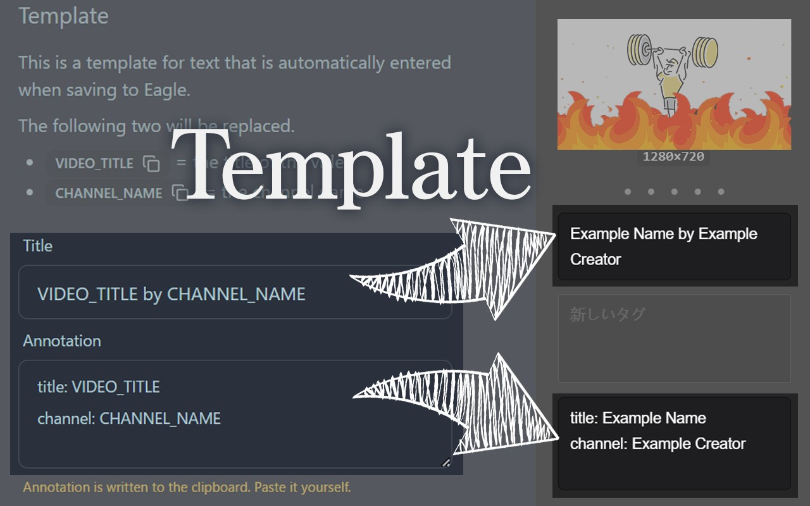

# Thumbnail To Eagle
Browser extension to quickly save YouTube thumbnails to [Eagle](https://eagle.cool/).

## Features

- 🖼️ Display thumbnail on YouTube video pages
- 🦅 Display Save button to Eagle
    - ⚙️ You can setup templates for input

## Usage
### Template
Click `Edit Template` to open the settings page.
You can set templates for `Title` and `Annotation`.

### ⚠️ Note
#### Q. Thumbnails and buttons do not appear.
A. Please reload the tab.
It may be hidden due to loading timing or conflicts with other extensions.

If it does not appear after reloading, YouTube may have changed its specifications. Please wait until this extension developer(me) responds.

#### Q. Annotation Template is not automatically filled in.
A. Yes, that is the correct behavior.
As mentioned on the Template setup page, **Annotation is written to the clipboard. Paste it yourself**.

#### Q. Suddenly I can't save to Eagle anymore.
A. On my gosh!

Eagle may have changed its specifications. Please wait until this extension developer(me) responds.

## Installation
- [Eagle](https://eagle.cool/) (recommendation)

WIP

# TODO
- [ ] オプションを開くボタン版でスクショを撮る

- [ ] 検索画面での保存
- [ ] popupでの表示

- [ ] 多言語対応の動画
  - meta name="title"? それ以外は大変そう
